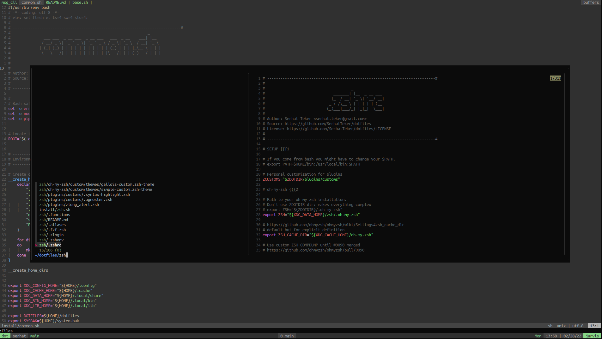

# Serhat's dotfiles

My personal dotfiles.

Always WIP.

If you want to give these dotfiles a try, you should first fork
this repository, review the code, and remove things you don’t want or need.
Don’t use my settings *AS IS* unless you know what that entails.


## Screenshots


<details>

<summary>Show More Screenshot</summary>




</details>


## On a new machine

```bash
# Base `install.sh` will call all necessary install scripts.
# It will check OS (Macos or Linux)
$ bash install.sh

# generate and add new SSH key
# https://docs.github.com/en/authentication/connecting-to-github-with-ssh/generating-a-new-ssh-key-and-adding-it-to-the-ssh-agent

# open LunarVim. Lazy.nvim will automatically install all plugins
$ lunarvim
```

### Post Install

#### MacOS

There is no need to do  anything. All covered by `install.sh` script.

#### Linux

For Gnome Terminal, use Tango colorschme with custom background:

- Text and Background Color: Tango Dark
- Custom Background : `#0B0B0B`
- Palette: Tango Dark

For `#080808`: https://www.colorhexa.com/080808

https://www.ditig.com/256-colors-cheat-sheet
