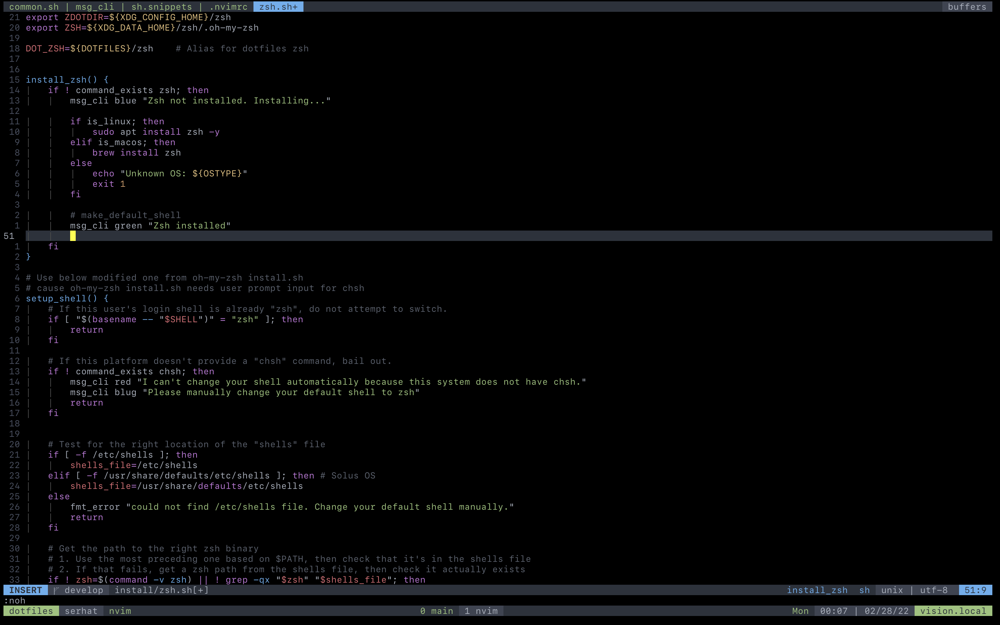
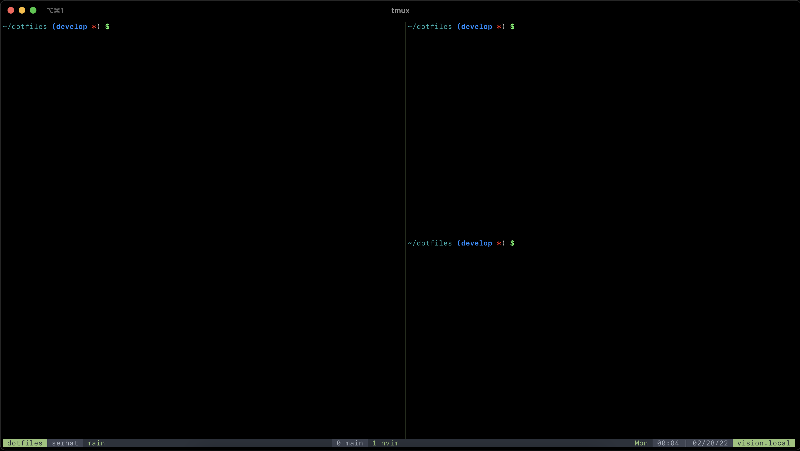
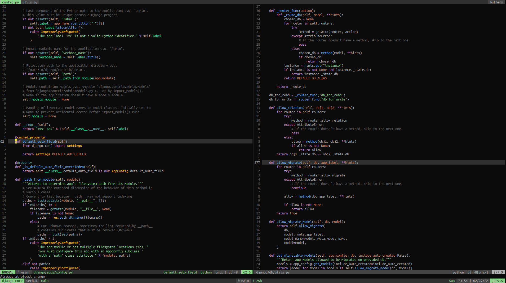

# Serhat's dotfiles

My personal dotfiles.

**Warning:** If you want to give these dotfiles a try, you should first fork
this repository, review the code, and remove things you don’t want or need.
Don’t use my settings unless you know what that entails.

**Warning:** WIP README and install scripts.

## Screenshots

Show More

## BASE

### Post Install Script

- Install related `ssh keys`

## MACOS

### Post Install Script

- Install *SF Mono* font (TODO: Add fonts to dotfiles)
- Install **Yubico** from appstore (TODO: include in script)
  https://www.yubico.com/products/yubico-authenticator/#h-download-yubico-authenticator

## LINUX

### Gnome Terminal

Use Tango colorschme with custom background:

- Text and Background Color: Tango Dark
- Custom Background : `#0B0B0B`
- Palette: Tango Dark

For `#080808`: https://www.colorhexa.com/080808

https://www.ditig.com/256-colors-cheat-sheet
