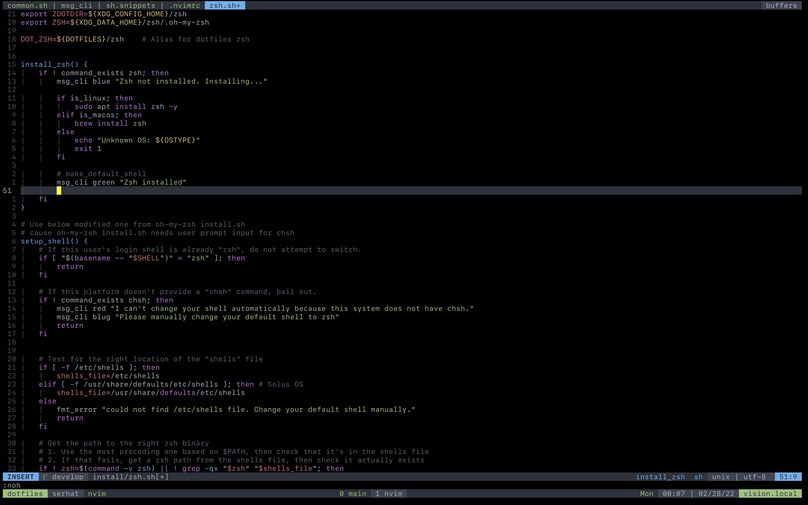
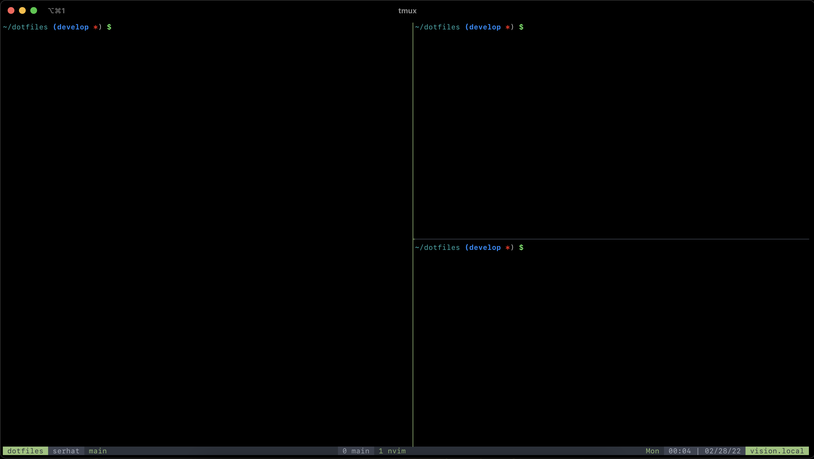
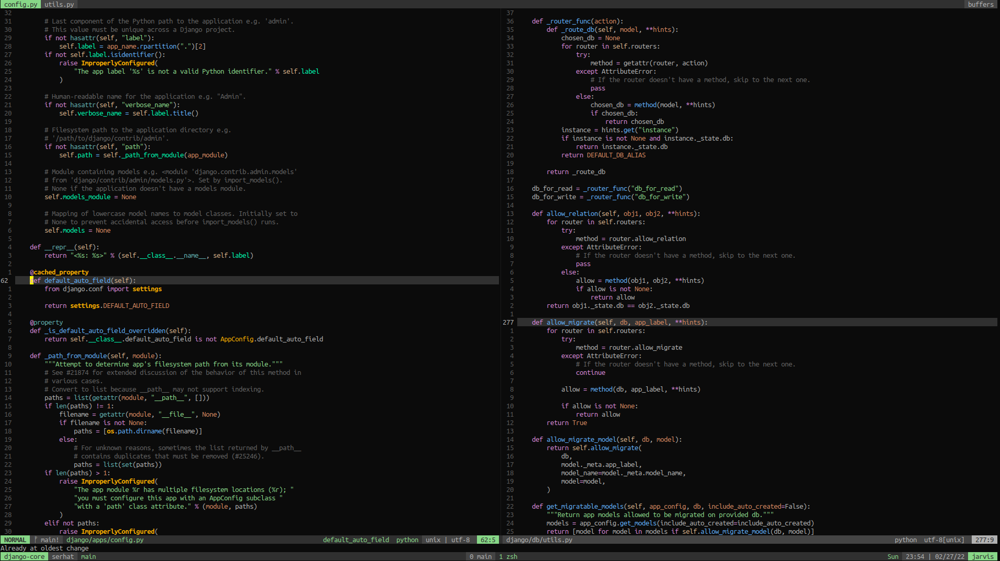
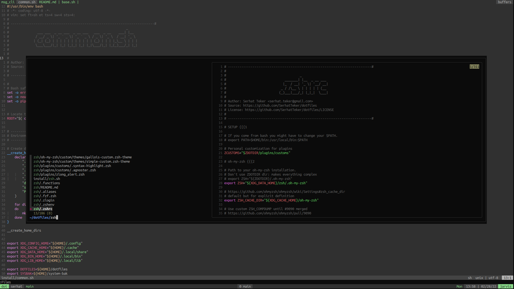

# Serhat's dotfiles

My personal dotfiles.

Don’t use my settings *AS IS*, unless you know what that entails.

If you want to give these dotfiles a try, you should first fork
this repository, review the code, and remove things you don’t want or need.

Always WIP.

## Screenshots


<details>

<summary>Show More Screenshot</summary>









</details>


## On a new machine

```bash
# Base `install.sh` will call all necessary install scripts.
$ ./install.sh

# generate and add new SSH key
# https://docs.github.com/en/authentication/connecting-to-github-with-ssh/generating-a-new-ssh-key-and-adding-it-to-the-ssh-agent

# Open NeoVim, it will automatically install all plugins.
$ nvim
```

### Post Install

There is no need to do anything. All covered by `install.sh` script.
